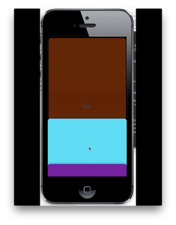

## MWWindow

Lightweight library that allows you to manage multiple windows in an iOS application and animate the transitions.

The demo application shows how to reproduce a transition like the Paper Facebook application.

<a href="http://youtu.be/LIE6YPZ7sgs"> Preview video </a>

## Installation
Simply add the ***library*** directory into your Xcode project.

To add a window to the screen:

	#import "MWWindow.h"
   	
	//where you want to add the window
	_nextWindow = [[MWWindow alloc] initWithFrame:[UIScreen mainScreen].bounds];
	_nextWindow.windowLevel = UIWindowLevelStatusBar;
    MWViewController *vc = [[MWViewController alloc] initWithNibName:@"MWViewController" bundle:nil];
    vc.view.backgroundColor = [UIColor clearColor];
    _nextWindow.rootViewController = vc;
    [_nextWindow makeKeyAndVisible];

## License
MWWindow is available under the MIT license. See the LICENSE file for more info.